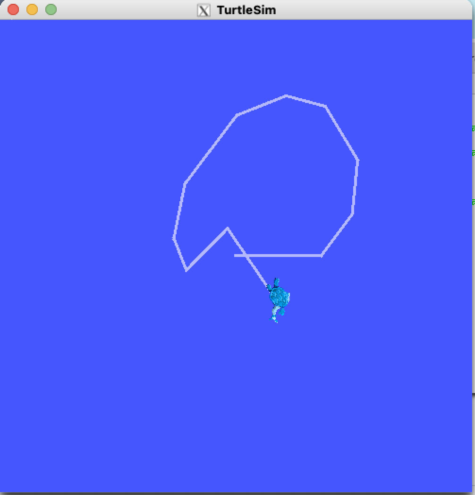

# PART 1
## PART 1-1
To Fix the issue that GUI applications can't not work correctlly on MacOS.
I followed [this video](https://www.youtube.com/watch?v=cNDR6Z24KLM&ab_channel=TechHara).

First download `XQuartz` and let it listen on local IP.

Then export system variable `DISPLAY` into `<local IP>:0`

```shell
# This to start GUI
ros2 run turtlesim turtlesim_node

# This to control turtle in another terminal console.
ros2 run turtlesim turtle_teleop_key

```

The result is as bellow.
<br>



## PART 1-2
```C
#include "rclcpp/rclcpp.hpp"
// Fill the missing line of code
// Hint: include the ROS2 integer 32 bit library for messaging
#include "std_msgs/msg/string.hpp"

int main(int argc, char** argv)
{
    rclcpp::init(argc, argv); // Initialize the ROS2 global context via argc and argv.
    auto node = rclcpp::Node::make_shared("publisher_node"); // create a node named publisher_node
    auto publisher = node->create_publisher<std_msgs::msg::Int32>("count_values", 10); // create a topic named count_values, and set the queue size to limite messages to 10.
    
    // 
    rclcpp::Rate loop_rate(1);
        
    int count = 1;
    while (rclcpp::ok() && count <= 5)
    {
        auto msg = std_msgs::msg::Int32();
        // Fill the missing line of code
        // Hint: makes the content of "msg" to be the value of "count" variable
	msg.data = std::to_string(count);

        publisher->publish(msg);
        RCLCPP_INFO(node->get_logger(), "Publishing: %d", msg.data); // This macro ensures messages are printed to the console.
        // Fill the missing line of code
        // Hint: execute the callback function under the "node" node
	

        loop_rate.sleep();
        count++;
    }
    
    rclcpp::shutdown();
    return 0;    
}
```
